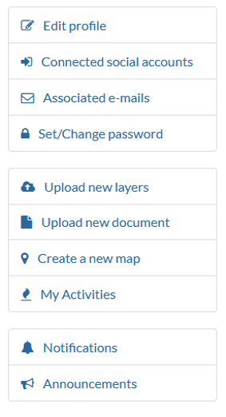

=========
Using CRD
=========

Registering and updating profile
^^^^^^^^^^^^^^^^^^^^^^^^^^^^^^^^

Registering
***********
Join the Climate Risk Database community by registering and updating your profile. As a member, you may access all CRD’s features, such as uploading layers and documents, and saving the maps you have created.

1. Click Register in the top-right corner.
2. Fill out the form. Enter your email, create username and password.
3. After administration of the CRD validates your account, you will get an email to confirm your account. After confirmation you are good to go and sign into the Climate Risk Database. Welcome aboard!

 .. image:: images/login_register.png
   :align: center

Updating profile
****************
First task after registering for you is to edit your user profile. Share information about you to the community by telling who you are, what your position is and where you are from.
You can update this information anytime.

Edit profile information
************************
1.	After signing in, go to your Profile page by clicking your username in the top-right corner.
2.	From the right-hand side menu, click Edit profile.
3.	Edit your personal information by adding your name, description of yourself and contact information. You can even edit your avatar.
4.	When finished, click Update profile at the bottom of the page.

Other settings
^^^^^^^^^^^^^^
From the same right-hand side menu, you can access other user settings as well, such as changing your password and setting your notification preferences.
You can find other interesting links and activities from this menu as well, feel free to explore them!

